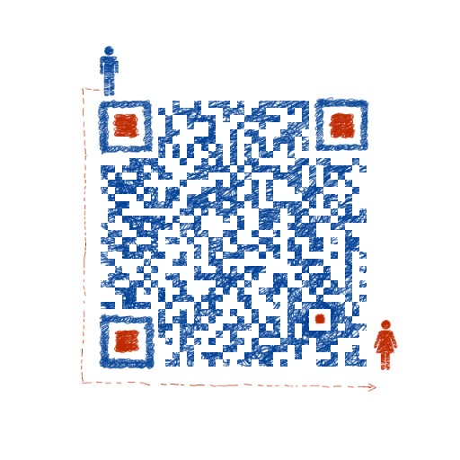

go 1.14.7源码解读
# 目前进行中：
- slice
# 目前已经完成:
- map
- json
# 如何使用该仓库
1. 定位到你的golang sdk的src目录下，不要犹豫，删了他们，干干净净的那种
2. 然后在该目录clone 该仓库
然后你就可以一边调试，一遍查看该仓库的注释了。
# 针对该项目的所有源码详解都会输出到微信公众号上去，欢迎关注查阅

# CSDN也会持续更新
[CSDN](https://blog.csdn.net/u010927340)
# 欢迎添加我的微信，一起交流

